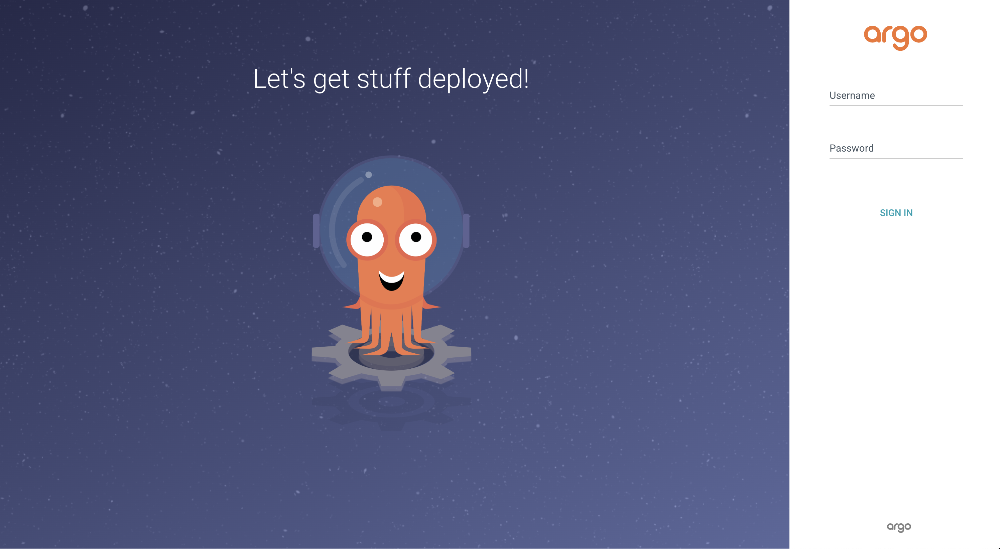

# Налаштування argo CD у кластері

----------------

## Вимагається

* [k3d](https://k3d.io/v5.6.0/)
* [Docker](https://docs.docker.com/get-docker/)
* [kubectl](https://kubernetes.io/ru/docs/tasks/tools/install-kubectl/)
* Запущений кластер kubernetes(як запускати можна дізнатись [тут](Concept.md))

-----------------

## Інструкція зі встановлення Argo CD до кластеру
1. Створення argo cd namespace ```kubectl create namespace argocd``` 
2. Встановлення необхідних залежностей argo cd до кластеру
```kubectl apply -n argocd -f https://raw.githubusercontent.com/argoproj/argo-cd/stable/manifests/install.yaml```
3. Відкривання порта для доступу до web UI
```kubectl port-forward -n argocd services/argocd-server 8080:80```
4. У браузері відкрити посилання на web UI ```localhost:8080```
5. Ввесли логін і пароль на сторінці авторизації.
Логін - ```admin```, для отримання пароля виконайте команду ```kubectl get secret argocd-initial-admin-secret -n argocd -o jsonpath="{.data.password}" | base64 -d```
<p>
  
</p>
6. Ваш argo cd готовий до роботи
<p>
  
</p>